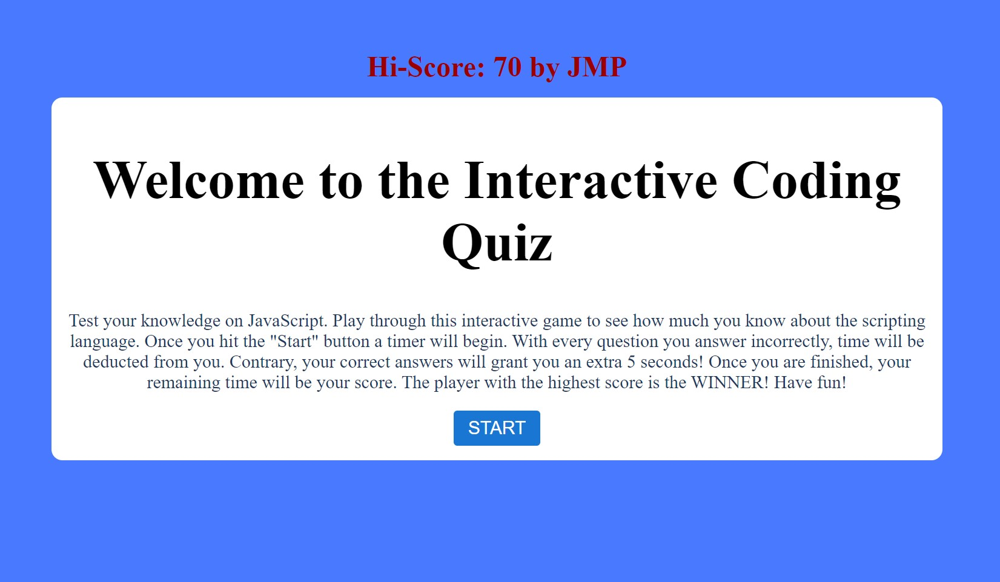
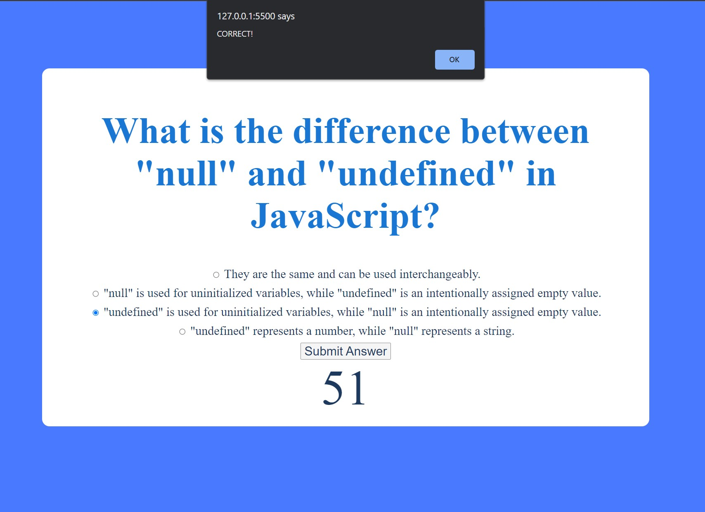

# interactive-coding-quiz
This project is an interactive coding quiz that leverages JavaScript logic to dynamically modify the HTML page, interact with user input, and store data persistently in the user's browser. It provides users with an opportunity to evaluate their understanding of JavaScript and allows them to save their scores to track their progress and compete with others.

### User Story
```md
AS A coding boot camp student
I WANT to take a timed quiz on JavaScript fundamentals that stores high scores
SO THAT I can gauge my progress compared to my peers
```

## Acceptance Criteria
```md
Acceptance Criteria
GIVEN I am taking a code quiz
WHEN I click the start button
THEN a timer starts and I am presented with a question
WHEN I answer a question
THEN I am presented with another question
WHEN I answer a question incorrectly
THEN time is subtracted from the clock
WHEN all questions are answered or the timer reaches 0
THEN the game is over
WHEN the game is over
THEN I can save my initials and score
```
## Examples






